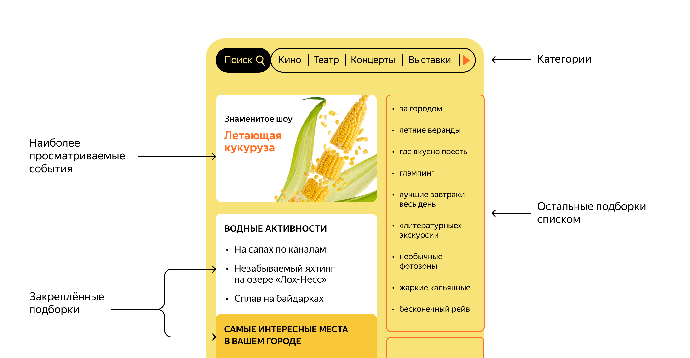

# Explore With Me

Explore With Me is an application designed to facilitate the organization, exploration, and participation in events.
It offers a wide range of functionalities for public users, event organizers, and administrators.
Search for events that interest you or among the most viewed, and sign up for participation.
Couldn't find an event? Create your own!
Clarify organizational issues in the comments section and don't forget to leave review about how the event went.

## Event Endpoints

### Event Public Endpoints

- **Get Events**
    - **URL**: `/events`
    - **Method**: `GET`
    - **Description**: Retrieve a list of events with optional filtering parameters.
    - **Parameters**:
        - `text` (optional): Filter by text.
        - `categories` (optional): Filter by categories.
        - `paid` (optional): Filter by paid status.
        - `rangeStart` (optional): Filter by event date (in `yyyy-MM-dd HH:mm:ss` format).
        - `rangeEnd` (optional): Filter by event date (in `yyyy-MM-dd HH:mm:ss` format).
        - `onlyAvailable` (default: `false`): Filter by availability.
        - `sort` (default: `EVENT_DATE`): Sort by criteria.
        - `from` (default: `0`): Pagination offset.
        - `size` (default: `10`): Pagination limit.

- **Get Event by ID**
    - **URL**: `/events/{eventId}`
    - **Method**: `GET`
    - **Description**: Retrieve event details by event ID.
    - **Parameters**:
        - `eventId`: ID of the event.

### Event Private (User-Specific) Endpoints

- **Add Event**
    - **URL**: `/users/{userId}/events`
    - **Method**: `POST`
    - **Description**: Add a new event by a user.
    - **Parameters**:
        - `userId`: ID of the user.
    - **Body**:
        - `eventNewDto`: Event data.

- **Update Event by Owner**
    - **URL**: `/users/{userId}/events/{eventId}`
    - **Method**: `PATCH`
    - **Description**: Update an event by the owner.
    - **Parameters**:
        - `userId`: ID of the user.
        - `eventId`: ID of the event.
    - **Body**:
        - `EventUpdateUserDto`: Updated event data.

- **Update Requests Status**
    - **URL**: `/users/{userId}/events/{eventId}/requests`
    - **Method**: `PATCH`
    - **Description**: Update the status of requests for an event.
    - **Parameters**:
        - `userId`: ID of the user.
        - `eventId`: ID of the event.
    - **Body**:
        - `EventRequestStatusUpdateRequest`: Request status update data.

- **Get Events by Owner**
    - **URL**: `/users/{userId}/events`
    - **Method**: `GET`
    - **Description**: Retrieve a list of events by the owner.
    - **Parameters**:
        - `userId`: ID of the user.
        - `from` (default: `0`): Pagination offset.
        - `size` (default: `10`): Pagination limit.

- **Get Event by Owner**
    - **URL**: `/users/{userId}/events/{eventId}`
    - **Method**: `GET`
    - **Description**: Retrieve event details by the owner.
    - **Parameters**:
        - `userId`: ID of the user.
        - `eventId`: ID of the event.

- **Get Requests by Event Owner**
    - **URL**: `/users/{userId}/events/{eventId}/requests`
    - **Method**: `GET`
    - **Description**: Retrieve requests for an event by the owner.
    - **Parameters**:
        - `userId`: ID of the user.
        - `eventId`: ID of the event.

### Event Admin Endpoints

- **Update Event by Admin**
    - **URL**: `/admin/events/{eventId}`
    - **Method**: `PATCH`
    - **Description**: Update an event by an admin.
    - **Parameters**:
        - `eventId`: ID of the event.
    - **Body**:
        - `eventUpdateAdminDto`: Updated event data.

- **Get Events by Admin Params**
    - **URL**: `/admin/events`
    - **Method**: `GET`
    - **Description**: Retrieve events based on admin parameters.
    - **Parameters**:
        - `users` (optional): Filter by users.
        - `states` (optional): Filter by states.
        - `categories` (optional): Filter by categories.
        - `rangeStart` (optional): Filter by event date (in `yyyy-MM-dd HH:mm:ss` format).
        - `rangeEnd` (optional): Filter by event date (in `yyyy-MM-dd HH:mm:ss` format).
        - `from` (default: `0`): Pagination offset.
        - `size` (default: `10`): Pagination limit.

## User Endpoints

### User Admin Endpoints

- **Add User**
    - **URL**: `/admin/users`
    - **Method**: `POST`
    - **Description**: Add a new user.
    - **Body**:
        - `userNewDto`: User data.

- **Get Users**
    - **URL**: `/admin/users`
    - **Method**: `GET`
    - **Description**: Retrieve a list of users with optional filtering parameters.
    - **Parameters**:
        - `ids` (optional): Filter by user IDs.
        - `from` (default: `0`): Pagination offset.
        - `size` (default: `10`): Pagination limit.

- **Delete User**
    - **URL**: `/admin/users/{userId}`
    - **Method**: `DELETE`
    - **Description**: Delete a user by ID.
    - **Parameters**:
        - `userId`: ID of the user.

## Request Endpoints

### Request Endpoints (User-Specific)

- **Add Request**
    - **URL**: `/users/{userId}/requests`
    - **Method**: `POST`
    - **Description**: Add a new request for an event.
    - **Parameters**:
        - `userId`: ID of the user.
        - `eventId`: ID of the event.

- **Cancel Request**
    - **URL**: `/users/{userId}/requests/{requestId}/cancel`
    - **Method**: `PATCH`
    - **Description**: Cancel a request for an event.
    - **Parameters**:
        - `userId`: ID of the user.
        - `requestId`: ID of the request.

- **Get Requests by User**
    - **URL**: `/users/{userId}/requests`
    - **Method**: `GET`
    - **Description**: Retrieve a list of requests made by the user.
    - **Parameters**:
        - `userId`: ID of the user.

## Compilation Endpoints

### Compilation Public Endpoints

- **Get Compilations**
    - **URL**: `/compilations`
    - **Method**: `GET`
    - **Description**: Retrieve a list of compilations with optional filtering parameters.
    - **Parameters**:
        - `pinned` (optional): Filter by pinned status.
        - `from` (default: `0`): Pagination offset.
        - `size` (default: `10`): Pagination limit.

- **Get Compilation by ID**
    - **URL**: `/compilations/{compilationId}`
    - **Method**: `GET`
    - **Description**: Retrieve compilation details by compilation ID.
    - **Parameters**:
        - `compilationId`: ID of the compilation.

### Compilation Admin Endpoints

- **Add Compilation**
    - **URL**: `/admin/compilations`
    - **Method**: `POST`
    - **Description**: Add a new compilation.
    - **Body**:
        - `newCompilationDto`: New compilation data.

- **Update Compilation**
    - **URL**: `/admin/compilations/{compilationId}`
    - **Method**: `PATCH`
    - **Description**: Update an existing compilation.
    - **Parameters**:
        - `compilationId`: ID of the compilation.
    - **Body**:
        - `updateCompilationDto`: Updated compilation data.

- **Delete Compilation**
    - **URL**: `/admin/compilations/{compilationId}`
    - **Method**: `DELETE`
    - **Description**: Delete a compilation by ID.
    - **Parameters**:
        - `compilationId`: ID of the compilation.

## Category Endpoints

### Category Public Endpoints

- **Get Categories**
    - **URL**: `/categories`
    - **Method**: `GET`
    - **Description**: Retrieve a list of categories with optional pagination parameters.
    - **Parameters**:
        - `from` (default: `0`): Pagination offset.
        - `size` (default: `10`): Pagination limit.

- **Get Category by ID**
    - **URL**: `/categories/{categoryId}`
    - **Method**: `GET`
    - **Description**: Retrieve category details by category ID.
    - **Parameters**:
        - `categoryId`: ID of the category.

### Category Admin Endpoints

- **Add Category**
    - **URL**: `/admin/categories`
    - **Method**: `POST`
    - **Description**: Add a new category.
    - **Parameters**:
        - `newCategoryDto`: New category data.

- **Update Category**
    - **URL**: `/admin/categories/{catId}`
    - **Method**: `PATCH`
    - **Description**: Update an existing category.
    - **Parameters**:
        - `catId`: ID of the category.
    - **Body**:
        - `categoryDto`: Updated category data.

- **Delete Category**
    - **URL**: `/admin/categories/{catId}`
    - **Method**: `DELETE`
    - **Description**: Delete a category by ID.
    - **Parameters**:
        - `catId`: ID of the category.

## Comment Endpoints

### Public Comment Endpoints

- **Get Comments for Event**
    - **URL**: `/comments/event/{eventId}`
    - **Method**: `GET`
    - **Description**: Retrieve a list of comments for a specific event with optional pagination parameters.
    - **Parameters**:
        - `eventId`: ID of the event.
        - `from` (default: `0`): Pagination offset.
        - `size` (default: `10`): Pagination limit.

- **Get Comment by ID**
    - **URL**: `/comments/{commentId}`
    - **Method**: `GET`
    - **Description**: Retrieve comment details by comment ID.
    - **Parameters**:
        - `commentId`: ID of the comment.

### Private Comment Endpoints (User-Specific)

- **Add Comment**
    - **URL**: `/users/{userId}/comments/{eventId}`
    - **Method**: `POST`
    - **Description**: Add a new comment for an event.
    - **Parameters**:
        - `userId`: ID of the user.
        - `eventId`: ID of the event.
    - **Body**:
        - `commentNewDto`: New comment data.

- **Update Comment**
    - **URL**: `/users/{userId}/comments/{commentId}`
    - **Method**: `PATCH`
    - **Description**: Update an existing comment.
    - **Parameters**:
        - `userId`: ID of the user.
        - `commentId`: ID of the comment.
    - **Body**:
        - `commentNewDto`: Updated comment data.

- **Get Comments by Author**
    - **URL**: `/users/{userId}/comments`
    - **Method**: `GET`
    - **Description**: Retrieve a list of comments made by the user with optional pagination parameters.
    - **Parameters**:
        - `userId`: ID of the user.
        - `from` (default: `0`): Pagination offset.
        - `size` (default: `10`): Pagination limit.

- **Delete Comment (User)**
    - **URL**: `/users/{userId}/comments/{commentId}`
    - **Method**: `DELETE`
    - **Description**: Delete a comment by ID as a user.
    - **Parameters**:
        - `userId`: ID of the user.
        - `commentId`: ID of the comment.

### Admin Comment Endpoints

- **Delete Comment (Admin)**
    - **URL**: `/admin/comments/{commentId}`
    - **Method**: `DELETE`
    - **Description**: Delete a comment by ID as an admin.
    - **Parameters**:
        - `commentId`: ID of the comment.

## Stats Endpoints

### Stats Endpoints

- **Add hit**
    - **URL**: `/hit`
    - **Method**: `POST`
    - **Description**: Add a new hit for an endpoint.
    - **Body**:
        - `endpointHitDto`: New hit data.

- **Get hits**
    - **URL**: `/stats`
    - **Method**: `GET`
    - **Description**: Retrieve a list of view stats with optional filtering and pagination parameters.
    - **Parameters**:
        - `start`: Filter by hit date (in `yyyy-MM-dd HH:mm:ss` format).
        - `end`: Filter by hit date (in `yyyy-MM-dd HH:mm:ss` format).
        - `uris` (optional): list of uris for filtering.
        - `unique` (default: `false`): return only unique hits.

Pull request link
https://github.com/VlchVV/java-explore-with-me/pull/4